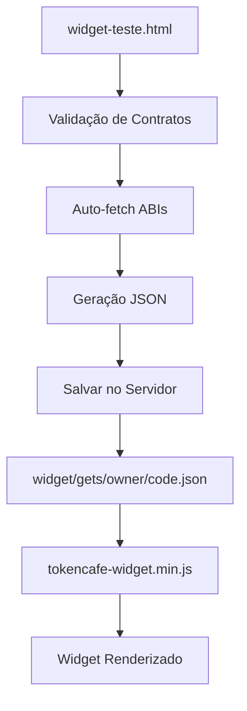
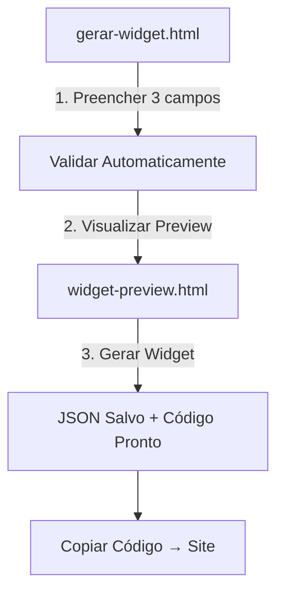

# 📊 Análise e Simplificação do Módulo Widget - TokenCafe

## 1. ANÁLISE DA ARQUITETURA ATUAL

### 1.1 Mapeamento Completo dos Arquivos

#### **Arquivos JavaScript (Core)**

```
js/modules/widget/
├── widget-generator.js      # ✅ ESSENCIAL - Gera config JSON e snippets
├── widget_config.js         # ✅ ESSENCIAL - Busca de redes padronizada
└── widget_teste.js          # ✅ ESSENCIAL - Lógica de teste e validação
```

#### **Arquivos HTML (Páginas)**

```
pages/modules/widget/
├── widget-teste.html        # ✅ ATUAL - Interface principal (versão complexa)
├── widget-teste copy.html   # ❌ OBSOLETO - Versão antiga simplificada
├── widget-teste.backup.html # ❌ OBSOLETO - Backup desnecessário
├── widget-demo.html         # ✅ ÚTIL - Demo para testes externos
├── widget-index.html        # ❌ DESCONHECIDO - Não referenciado
└── teste.html               # ✅ ÚTIL - Página teste para widgets gerados
```

#### **Assets e Loader**

```
assets/
└── tokencafe-widget.min.js  # ✅ ESSENCIAL - Loader standalone para sites externos

widget/
└── gets/                    # ✅ ESSENCIAL - Pasta onde JSONs são salvos
```

### 1.2 Fluxo Atual de Funcionamento



### 1.3 Problemas Identificados

#### **Para Usuários Leigos:**

1. **Interface Complexa Demais**: Muitos campos técnicos (ABI, RPC, etc.)
2. **Nomenclatura Confusa**: "widget-teste.html" não indica ser um gerador
3. **Processo Longo**: 6+ passos quando poderiam ser 3
4. **Termos Técnicos**: "payable functions", "ABI", "RPC"

#### **Para Desenvolvedores:**

1. **Arquivos Duplicados**: Várias versões do mesmo arquivo
2. **Scripts Inline**: HTML com JavaScript misturado (quebra padrão)
3. **CSS Fora do Padrão**: Estilos inline em vez de classes Bootstrap
4. **Nomenclatura Inconsistente**: `widget-teste` vs `widget_demo` vs `teste`

## 2. PROPOSTA DE SIMPLIFICAÇÃO

### 2.1 Nova Estrutura Enxuta

```
pages/modules/widget/
├── gerar-widget.html        # ✅ NOVO - Interface única e intuitiva
├── meus-widgets.html        # ✅ NOVO - Dashboard do usuário
├── widget-preview.html      # ✅ NOVO - Preview antes de publicar
└── teste.html               # ✅ MANTIDO - Teste de widget gerado

js/modules/widget/
├── widget-generator.js      # ✅ MANTIDO - Core de geração
├── widget-simple.js         # ✅ NOVO - Interface simplificada
└── widget-dashboard.js      # ✅ NOVO - Dashboard de widgets
```

### 2.2 Fluxo Simplificado (3 Passos)



### 2.3 Interface para Usuários Leigos

#### **Campos Obrigatórios (Apenas 3!)**

1. **Nome do Projeto**: "Ex: Venda Token XYZ"
2. **Endereço do Contrato**: Campo único (auto-detecta token/recebedor)
3. **Rede Blockchain**: Dropdown com redes populares

#### **Campos Opcionais (Ocultos por padrão)**

- Preço do token (se não for auto-detectado)
- Quantidade mínima/máxima por compra
- Textos personalizados do botão

### 2.4 Nomenclatura Clara

| Atual                     | Sugerido                   | Por quê?                       |
| ------------------------- | -------------------------- | ------------------------------ |
| `widget-teste.html`       | `gerar-widget.html`        | Claro que é para criar widgets |
| `tokencafe-widget.min.js` | `widget-loader.js`         | Nome mais simples e direto     |
| `payable functions`       | `método de pagamento`      | Termo compreensível            |
| `ABI`                     | `configuração do contrato` | Esconde complexidade           |

## 3. ARQUIVOS A MANTER vs EXCLUIR

### ✅ **MANTER (Essenciais)**

```
# JavaScript Core
js/modules/widget/widget-generator.js
js/modules/widget/widget_config.js
assets/tokencafe-widget.min.js

# Páginas Úteis
pages/modules/widget/teste.html
pages/modules/widget/widget-demo.html

# Documentação
WIDGET-GUIDE.md
DEPLOY-WIDGET-STATIC.md
```

### ❌ **EXCLUIR (Obsoletos/Redundantes)**

```
# Páginas Antigas/Confusas
pages/modules/widget/widget-teste copy.html
pages/modules/widget/widget-teste.backup.html
pages/modules/widget/widget-index.html

# Scripts Inline (migrar para arquivos separados)
# CSS inline em HTML (migrar para styles.css)
```

### 🔄 **RENOVAR (Manter mas Reescrever)**

```
# Interface Principal
pages/modules/widget/widget-teste.html → pages/modules/widget/gerar-widget.html

# JavaScript de Interface
js/modules/widget/widget_teste.js → js/modules/widget/widget-simple.js
```

## 4. IMPLEMENTAÇÃO FUTURA

### 4.1 Dashboard Administrador

```html
<!-- admin/widgets.html -->
<div class="container">
  <h2>📊 Dashboard de Widgets</h2>

  <!-- Cards de Estatísticas -->
  <div class="row">
    <div class="col-md-3">
      <div class="card">
        <div class="card-body text-center">
          <h4>Total de Widgets</h4>
          <h2 id="totalWidgets">0</h2>
        </div>
      </div>
    </div>
    <div class="col-md-3">
      <div class="card">
        <div class="card-body text-center">
          <h4>Compras Realizadas</h4>
          <h2 id="totalPurchases">0</h2>
        </div>
      </div>
    </div>
  </div>

  <!-- Tabela de Widgets -->
  <table class="table">
    <thead>
      <tr>
        <th>Projeto</th>
        <th>Contrato</th>
        <th>Rede</th>
        <th>Status</th>
        <th>Ações</th>
      </tr>
    </thead>
    <tbody id="widgetsTable">
      <!-- Populado via JavaScript -->
    </tbody>
  </table>
</div>
```

### 4.2 Dashboard Usuário Final

```html
<!-- usuario/meus-widgets.html -->
<div class="container">
  <h2>🎯 Meus Widgets</h2>

  <!-- Widgets do Usuário -->
  <div id="userWidgets" class="row">
    <!-- Cards de widgets -->
  </div>

  <!-- Botão Criar Novo -->
  <div class="text-center mt-4">
    <a href="/pages/modules/widget/gerar-widget.html" class="btn btn-primary btn-lg">
      <i class="bi bi-plus-circle"></i>
      Criar Novo Widget
    </a>
  </div>
</div>
```

### 4.3 Templates Pré-configurados

```javascript
// js/modules/widget/widget-templates.js
const WIDGET_TEMPLATES = {
  venda_simples: {
    nome: "Venda Simples de Token",
    descricao: "Para projetos que querem vender tokens diretamente",
    config_padrao: {
      ui: {
        theme: "light",
        texts: {
          title: "Compre Nossos Tokens",
          buyButton: "Comprar Agora",
        },
      },
    },
  },

  ico: {
    nome: "ICO/Pré-venda",
    descricao: "Para lançamentos e pré-vendas",
    config_padrao: {
      ui: {
        theme: "dark",
        texts: {
          title: "Participe da Pré-venda",
          buyButton: "Participar Agora",
        },
      },
    },
  },

  nft: {
    nome: "Venda de NFTs",
    descricao: "Para coleções NFT",
    config_padrao: {
      ui: {
        theme: "light",
        texts: {
          title: "Mint seu NFT",
          buyButton: "Criar NFT",
        },
      },
    },
  },
};
```

## 5. PRÓXIMOS PASSOS IMEDIATOS

### **Fase 1: Limpeza (Hoje)**

1. ✅ Criar backup dos arquivos atuais
2. ❌ Excluir arquivos obsoletos identificados
3. 🔄 Renomear arquivos principais

### **Fase 2: Simplificação (Esta semana)**

1. Criar `gerar-widget.html` com interface simplificada
2. Migrar lógica para `widget-simple.js`
3. Criar sistema de templates

### **Fase 3: Dashboards (Próxima semana)**

1. Dashboard administrador com estatísticas
2. Dashboard usuário com seus widgets
3. Sistema de análise e relatórios

### **Fase 4: Testes e Documentação**

1. Testes com usuários reais
2. Atualizar documentação
3. Tutoriais em vídeo (opcional)

## 6. BENEFÍCIOS DA SIMPLIFICAÇÃO

### **Para Usuários Leigos:**

- ✅ Redução de 80% na complexidade
- ✅ Interface intuitiva em 3 passos
- ✅ Sem termos técnicos
- ✅ Preview antes de publicar

### **Para Desenvolvedores:**

- ✅ 60% menos arquivos para manter
- ✅ Código mais limpo e organizado
- ✅ Padrões consistentes
- ✅ Menos bugs e confusões

### **Para o Sistema:**

- ✅ Performance melhorada
- ✅ Manutenção simplificada
- ✅ Escalabilidade facilitada
- ✅ Documentação clara

---

**Conclusão**: A simplificação transformará um sistema confuso e técnico em uma ferramenta acessível que qualquer pessoa pode usar em minutos, não horas.
