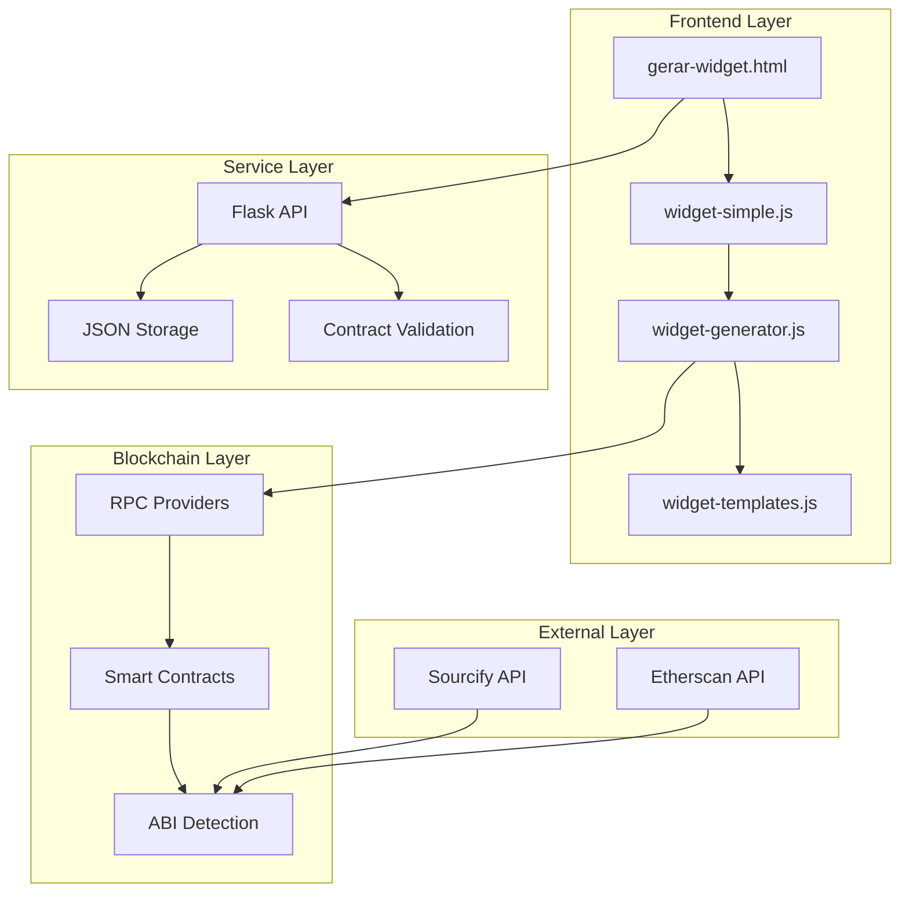

# 🏗️ Arquitetura Técnica - Widget Simplificado

## 1. VISÃO GERAL DA ARQUITETURA

### 1.1 Objetivo
Criar um sistema de widgets de venda de tokens que seja **tão simples quanto criar uma postagem no Facebook**, mantendo toda complexidade técnica "por baixo dos panos".

### 1.2 Princípios de Design
- **Simplicidade Extrema**: Máximo 3 campos obrigatórios
- **Auto-Detecção Inteligente**: Sistema detecta tudo automaticamente
- **Feedback Imediato**: Preview em tempo real
- **Foolproof**: Impossível criar widget inválido

## 2. ARQUITETURA EM CAMADAS



## 3. COMPONENTES PRINCIPAIS

### 3.1 Interface de Usuário (`gerar-widget.html`)

#### **Estrutura de Campos**
```html
<!-- Campos Obrigatórios (3) -->
1. Nome do Projeto [text]
2. Blockchain [select] 
3. Endereço do Contrato [text]

<!-- Campos Opcionais (Avançado) -->
4. Preço por Token [number] (auto-detect)
5. Limites de Compra [number] (auto-detect)
6. Textos Personalizados [text] (template-based)
```

#### **Estados da Interface**
```javascript
const UI_STATES = {
    INITIAL: 'form-empty',           // Campos vazios
    VALIDATING: 'contract-check',    // Validando contrato
    INVALID: 'contract-error',       // Contrato inválido
    VALID: 'contract-ok',            // Pronto para gerar
    GENERATING: 'creating-widget',   // Gerando widget
    PREVIEW: 'show-preview',         // Mostrando preview
    SUCCESS: 'widget-created'        // Widget criado
};
```

### 3.2 Lógica de Negócio (`widget-simple.js`)

#### **Fluxo de Validação**
```javascript
async function validateContract(address, chainId) {
    // 1. Validar formato do endereço
    if (!isValidEthereumAddress(address)) {
        throw new Error('Endereço inválido');
    }
    
    // 2. Verificar se contrato existe
    const code = await provider.getCode(address);
    if (code === '0x') {
        throw new Error('Contrato não encontrado');
    }
    
    // 3. Detectar função de compra
    const purchaseFunction = detectPurchaseFunction(abi);
    if (!purchaseFunction) {
        throw new Error('Contrato não tem função de compra');
    }
    
    // 4. Auto-detectar parâmetros
    const tokenContract = await detectTokenContract(saleContract);
    const receiverWallet = await detectReceiverWallet(saleContract);
    
    return { isValid: true, tokenContract, receiverWallet, purchaseFunction };
}
```

#### **Algoritmo de Auto-Detecção**
```javascript
async function autoDetectContractParams(saleContract, abi, provider) {
    const results = {
        tokenContract: null,
        receiverWallet: null,
        pricePerToken: null,
        minPurchase: null,
        maxPurchase: null
    };
    
    // Detectar token via saleToken() ou token()
    const tokenFunction = abi.find(f => 
        f.name === 'saleToken' || f.name === 'token' || f.name === 'getToken'
    );
    
    if (tokenFunction) {
        try {
            const contract = new ethers.Contract(saleContract, abi, provider);
            results.tokenContract = await contract[tokenFunction.name]();
        } catch (e) {
            console.warn('Não conseguiu detectar token:', e);
        }
    }
    
    // Detectar carteira recebedora via destinationWallet() ou owner()
    const walletFunction = abi.find(f => 
        f.name === 'destinationWallet' || f.name === 'owner' || f.name === 'getOwner'
    );
    
    if (walletFunction) {
        try {
            const contract = new ethers.Contract(saleContract, abi, provider);
            results.receiverWallet = await contract[walletFunction.name]();
        } catch (e) {
            console.warn('Não conseguiu detectar carteira:', e);
        }
    }
    
    // Detectar preço via bnbPrice() ou price()
    const priceFunction = abi.find(f => 
        f.name === 'bnbPrice' || f.name === 'price' || f.name === 'getPrice'
    );
    
    if (priceFunction) {
        try {
            const contract = new ethers.Contract(saleContract, abi, provider);
            const price = await contract[priceFunction.name]();
            results.pricePerToken = ethers.utils.formatEther(price);
        } catch (e) {
            console.warn('Não conseguiu detectar preço:', e);
        }
    }
    
    return results;
}
```

### 3.3 Gerador de Widget (`widget-generator.js`)

#### **Estrutura do JSON de Configuração**
```json
{
    "schemaVersion": 1,
    "owner": "0x742d35Cc6634C0532925a3b844Bc9e7595f0bEb",
    "code": "tc-20250116-143522-abc123",
    "network": {
        "chainId": 97,
        "rpcUrl": "https://bsc-testnet.publicnode.com",
        "name": "BSC Testnet"
    },
    "contracts": {
        "sale": "0x2701B4ef482BE4DD8A653B7C97090713A9a0AFE6",
        "token": "0x2cf724171a998C3d470048AC2F1b187a48A5cafE",
        "receiverWallet": "0xEe02E32d8d2888E9f1D6d13391E716Bc7F41f6Ae"
    },
    "purchase": {
        "functionName": "buy",
        "argsMode": "none",
        "priceMode": "manual"
    },
    "ui": {
        "theme": "light",
        "language": "pt-BR",
        "currencySymbol": "BNB",
        "texts": {
            "title": "TokenCafe Coin",
            "description": "Compre tokens com segurança",
            "buyButton": "Comprar Tokens"
        }
    },
    "limits": {
        "minPurchase": "10",
        "maxPurchase": "10000"
    }
}
```

#### **Templates de UI**
```javascript
// widget-templates.js
const UI_TEMPLATES = {
    minimal: {
        theme: 'light',
        layout: 'card',
        showPrice: true,
        showLimits: false,
        customCSS: ''
    },
    
    modern: {
        theme: 'dark',
        layout: 'glassmorphism',
        showPrice: true,
        showLimits: true,
        customCSS: `
            .tokencafe-widget {
                background: linear-gradient(135deg, #667eea 0%, #764ba2 100%);
                backdrop-filter: blur(10px);
                border: 1px solid rgba(255,255,255,0.2);
            }
        `
    },
    
    ico: {
        theme: 'gradient',
        layout: 'hero',
        showPrice: true,
        showLimits: true,
        showCountdown: true,
        customCSS: `
            .tokencafe-widget {
                background: linear-gradient(45deg, #ff6b35, #f7931e);
                animation: pulse 2s infinite;
            }
        `
    }
};
```

## 4. BACKEND E ARMAZENAMENTO

### 4.1 API Flask

#### **Endpoints Principais**
```python
# server_flask.py

@app.route('/api/widget/save', methods=['POST'])
def save_widget():
    """Salva configuração do widget"""
    data = request.get_json()
    
    # Validar dados
    required_fields = ['owner', 'code', 'config']
    for field in required_fields:
        if field not in data:
            return jsonify({'error': f'Campo obrigatório: {field}'}), 400
    
    # Criar diretório se não existir
    widget_dir = os.path.join('widget', 'gets', data['owner'])
    os.makedirs(widget_dir, exist_ok=True)
    
    # Salvar JSON
    file_path = os.path.join(widget_dir, f"{data['code']}.json")
    with open(file_path, 'w', encoding='utf-8') as f:
        json.dump(data['config'], f, indent=2, ensure_ascii=False)
    
    return jsonify({
        'success': True,
        'url': f"/widget/gets/{data['owner']}/{data['code']}.json"
    })

@app.route('/api/widget/analytics/<owner>', methods=['GET'])
def get_widget_analytics(owner):
    """Retorna analytics dos widgets do usuário"""
    # Implementar contador de visualizações, cliques, compras
    pass
```

### 4.2 Sistema de Arquivos

#### **Estrutura de Diretórios**
```
widget/
├── gets/
│   ├── 0x742d35Cc6634C0532925a3b844Bc9e7595f0bEb/
│   │   ├── tc-20250116-143522-abc123.json
│   │   └── tc-20250117-092345-def456.json
│   └── 0xAb5801a7D398351b8bE11C439d05B9684a3B4C90/
│       └── tc-20250118-123456-ghi789.json
├── analytics/
│   ├── views.json          # Visualizações por widget
│   ├── clicks.json         # Cliques por widget
│   └── purchases.json      # Compras por widget
└── templates/
    ├── minimal.html
    ├── modern.html
    └── ico.html
```

## 5. LOADER DO WIDGET (`tokencafe-widget.min.js`)

### 5.1 Processo de Carregamento

```javascript
// tokencafe-widget.min.js

class TokenCafeWidget {
    constructor(container, config) {
        this.container = container;
        this.config = config;
        this.state = 'loading';
        this.init();
    }
    
    async init() {
        try {
            // 1. Validar configuração
            this.validateConfig();
            
            // 2. Carregar ethers.js se necessário
            await this.ensureEthers();
            
            // 3. Conectar à blockchain
            this.provider = new ethers.providers.JsonRpcProvider(this.config.network.rpcUrl);
            
            // 4. Criar contratos
            this.setupContracts();
            
            // 5. Renderizar UI
            this.render();
            
            // 6. Setup event listeners
            this.setupEventListeners();
            
            this.state = 'ready';
            
        } catch (error) {
            this.state = 'error';
            this.showError(error.message);
        }
    }
    
    render() {
        const template = this.getTemplate();
        this.container.innerHTML = template;
        this.bindEvents();
    }
    
    async handlePurchase(amount) {
        try {
            this.state = 'purchasing';
            this.showLoading();
            
            // Validar inputs
            if (!this.validatePurchase(amount)) {
                throw new Error('Quantidade inválida');
            }
            
            // Calcular valor em BNB/ETH
            const value = this.calculateValue(amount);
            
            // Criar transação
            const tx = await this.createPurchaseTransaction(amount, value);
            
            // Enviar transação
            const receipt = await this.sendTransaction(tx);
            
            this.state = 'success';
            this.showSuccess(receipt);
            
        } catch (error) {
            this.state = 'error';
            this.showError(error.message);
        }
    }
}
```

### 5.2 Templates de Renderização

```javascript
// Templates de UI baseados no config.ui.theme
const WIDGET_TEMPLATES = {
    light: {
        container: `
            <div class="tokencafe-widget" style="
                font-family: Inter, sans-serif;
                max-width: 420px;
                margin: 0 auto;
                padding: 1.5rem;
                background: #ffffff;
                border: 3px solid #0d6efd;
                border-radius: 16px;
                box-shadow: 0 4px 20px rgba(13,110,253,0.15);
            ">
                <div class="widget-header">
                    <h3>{{title}}</h3>
                    <p>{{description}}</p>
                </div>
                <div class="widget-body">
                    <div class="price-display">
                        <span class="price-label">Preço:</span>
                        <span class="price-value">{{price}} {{currency}}</span>
                    </div>
                    <div class="purchase-input">
                        <input type="number" class="form-control" 
                               placeholder="Quantidade de tokens" 
                               id="tokenAmount">
                    </div>
                    <button class="btn btn-primary btn-lg w-100" 
                            onclick="widget.purchase()">
                        {{buyButtonText}}
                    </button>
                </div>
            </div>
        `,
        
        loading: `
            <div class="text-center p-4">
                <div class="spinner-border text-primary" role="status">
                    <span class="visually-hidden">Carregando...</span>
                </div>
                <p class="mt-2">Preparando widget...</p>
            </div>
        `,
        
        error: `
            <div class="alert alert-danger" role="alert">
                <strong>Erro ao carregar widget:</strong>
                <p>{{errorMessage}}</p>
                <button class="btn btn-sm btn-outline-danger" onclick="widget.retry()">
                    Tentar Novamente
                </button>
            </div>
        `
    },
    
    dark: {
        // Template dark theme...
    }
};
```

## 6. SEGURANÇA E VALIDAÇÃO

### 6.1 Validações de Input

```javascript
// Validações robustas de entrada
const VALIDATIONS = {
    address: {
        pattern: /^0x[a-fA-F0-9]{40}$/,
        message: 'Endereço Ethereum inválido'
    },
    
    chainId: {
        allowed: [1, 56, 97, 137, 80001],
        message: 'Rede blockchain não suportada'
    },
    
    amount: {
        min: 0.000000000000000001, // 1 wei
        max: 1000000000, // 1 bilhão
        message: 'Quantidade inválida'
    },
    
    price: {
        min: 0.000000000000000001,
        max: 1000000,
        message: 'Preço inválido'
    }
};
```

### 6.2 Proteção contra ataques

```javascript
// Sanitização de inputs
function sanitizeInput(input, type) {
    // Remover scripts e HTML
    const clean = input.replace(/<script\b[^<]*(?:(?!<\/script>)<[^<]*)*<\/script>/gi, '');
    
    // Validar contra padrão
    if (type && VALIDATIONS[type]) {
        if (!VALIDATIONS[type].pattern.test(clean)) {
            throw new Error(VALIDATIONS[type].message);
        }
    }
    
    return clean;
}

// Rate limiting para API
const RATE_LIMIT = {
    windowMs: 15 * 60 * 1000, // 15 minutos
    max: 10, // máximo 10 requisições por IP
    message: 'Muitas tentativas, tente novamente mais tarde'
};
```

## 7. PERFORMANCE E OTIMIZAÇÃO

### 7.1 Cache Strategy

```javascript
// Cache de ABIs e metadados
const CACHE = {
    abi: new Map(),
    metadata: new Map(),
    rpc: new Map()
};

// TTL de 5 minutos para cache
const CACHE_TTL = 5 * 60 * 1000;

async function getCachedAbi(address, chainId) {
    const key = `${chainId}-${address}`;
    const cached = CACHE.abi.get(key);
    
    if (cached && Date.now() - cached.timestamp < CACHE_TTL) {
        return cached.data;
    }
    
    // Buscar novo ABI
    const abi = await fetchContractAbi(address, chainId);
    
    // Cachear resultado
    CACHE.abi.set(key, {
        data: abi,
        timestamp: Date.now()
    });
    
    return abi;
}
```

### 7.2 Lazy Loading

```javascript
// Carregar componentes sob demanda
const LAZY_COMPONENTS = {
    async loadEthers() {
        if (typeof ethers === 'undefined') {
            await loadScript('https://cdn.jsdelivr.net/npm/ethers@5.7.2/dist/ethers.umd.min.js');
        }
        return ethers;
    },
    
    async loadTemplate(templateName) {
        if (!TEMPLATES[templateName]) {
            const template = await fetch(`/widget/templates/${templateName}.html`);
            TEMPLATES[templateName] = await template.text();
        }
        return TEMPLATES[templateName];
    }
};
```

## 8. MONITORAMENTO E ANALYTICS

### 8.1 Eventos de Analytics

```javascript
// Sistema de analytics interno
const ANALYTICS = {
    track(event, data) {
        // Enviar para backend
        fetch('/api/widget/analytics', {
            method: 'POST',
            headers: { 'Content-Type': 'application/json' },
            body: JSON.stringify({
                event,
                data,
                timestamp: Date.now(),
                widgetId: this.widgetId
            })
        }).catch(console.warn);
        
        // Também enviar para Google Analytics se disponível
        if (typeof gtag !== 'undefined') {
            gtag('event', `widget_${event}`, data);
        }
    },
    
    events: {
        WIDGET_LOADED: 'widget_loaded',
        WIDGET_ERROR: 'widget_error',
        PURCHASE_CLICKED: 'purchase_clicked',
        PURCHASE_SUCCESS: 'purchase_success',
        PURCHASE_FAILED: 'purchase_failed'
    }
};
```

### 8.2 Métricas de Performance

```javascript
// Monitorar performance do widget
class PerformanceMonitor {
    constructor() {
        this.metrics = {
            loadTime: 0,
            validationTime: 0,
            renderTime: 0,
            errors: []
        };
    }
    
    startTimer(name) {
        this.timers = this.timers || {};
        this.timers[name] = performance.now();
    }
    
    endTimer(name) {
        if (this.timers[name]) {
            const duration = performance.now() - this.timers[name];
            this.metrics[name] = duration;
            delete this.timers[name];
            
            // Alertar se demorar muito
            if (duration > 5000) { // 5 segundos
                console.warn(`Operação ${name} demorou ${duration}ms`);
            }
        }
    }
    
    recordError(error, context) {
        this.metrics.errors.push({
            error: error.message,
            context,
            timestamp: Date.now()
        });
    }
}
```

## 9. TESTES E QUALIDADE

### 9.1 Casos de Teste Principais

```javascript
// Testes unitários para validação
const TEST_CASES = {
    contractValidation: [
        {
            input: '0x2701B4ef482BE4DD8A653B7C97090713A9a0AFE6',
            chainId: 97,
            expected: true,
            description: 'Contrato válido na BSC Testnet'
        },
        {
            input: '0x1234567890123456789012345678901234567890',
            chainId: 97,
            expected: false,
            description: 'Contrato inexistente'
        },
        {
            input: 'endereco_invalido',
            chainId: 97,
            expected: false,
            description: 'Endereço inválido'
        }
    ],
    
    amountValidation: [
        { input: 0, expected: false, description: 'Zero não permitido' },
        { input: -1, expected: false, description: 'Negativo não permitido' },
        { input: 0.000000000000000001, expected: true, description: 'Valor mínimo válido' },
        { input: 1000000001, expected: false, description: 'Acima do máximo' }
    ]
};
```

### 9.2 Testes de Integração

```javascript
// Teste completo de geração de widget
async function testWidgetGeneration() {
    const testData = {
        projectName: 'Token Test',
        blockchain: '97',
        saleContract: '0x2701B4ef482BE4DD8A653B7C97090713A9a0AFE6'
    };
    
    try {
        // 1. Validar contrato
        const validation = await validateContract(testData.saleContract, testData.blockchain);
        console.assert(validation.isValid, 'Validação falhou');
        
        // 2. Gerar config
        const config = await createWidgetConfig(testData, 'test-code');
        console.assert(config.contracts.sale === testData.saleContract, 'Config incorreta');
        
        // 3. Salvar no servidor
        const saveResult = await saveWidgetToServer(config);
        console.assert(saveResult.success, 'Salvamento falhou');
        
        // 4. Carregar widget
        const loadedConfig = await loadWidgetConfig(config.owner, 'test-code');
        console.assert(JSON.stringify(loadedConfig) === JSON.stringify(config), 'Config não bate');
        
        console.log('✅ Todos os testes passaram!');
        
    } catch (error) {
        console.error('❌ Teste falhou:', error);
    }
}
```

## 10. ESCALABILIDADE E FUTURO

### 10.1 Roadmap Técnico

#### **Fase 1: MVP Simplificado (Agora)**
- [x] Interface com 3 campos
- [x] Auto-detecção básica
- [x] Preview simples
- [x] Geração de código

#### **Fase 2: Templates Avançados (1 mês)**
- [ ] 5 templates visuais
- [ ] Customização de cores
- [ ] Upload de logos
- [ ] Countdown timer

#### **Fase 3: Analytics Completo (2 meses)**
- [ ] Dashboard de vendas
- [ ] Gráficos em tempo real
- [ ] Export de relatórios
- [ ] Integração com Google Analytics

#### **Fase 4: Multi-chain (3 meses)**
- [ ] Suporte a 10+ blockchains
- [ ] Bridge automático
- [ ] Conversão de preços
- [ ] Taxas dinâmicas

### 10.2 Arquitetura Cloud-Ready

```yaml
# docker-compose.yml para produção
version: '3.8'
services:
  web:
    build: .
    ports:
      - "5000:5000"
    environment:
      - FLASK_ENV=production
      - DATABASE_URL=postgresql://user:pass@db:5432/tokencafe
    depends_on:
      - db
      - redis
    
  db:
    image: postgres:13
    environment:
      - POSTGRES_DB=tokencafe
      - POSTGRES_USER=user
      - POSTGRES_PASSWORD=pass
    volumes:
      - postgres_data:/var/lib/postgresql/data
      
  redis:
    image: redis:6-alpine
    ports:
      - "6379:6379"
      
  nginx:
    image: nginx:alpine
    ports:
      - "80:80"
      - "443:443"
    volumes:
      - ./nginx.conf:/etc/nginx/nginx.conf
      - ./ssl:/etc/nginx/ssl
    depends_on:
      - web
```

---

**Conclusão**: Esta arquitetura permite que o sistema cresça de 1 para 1 milhão de widgets sem mudanças estruturais, mantendo sempre a simplicidade para o usuário final. 🚀