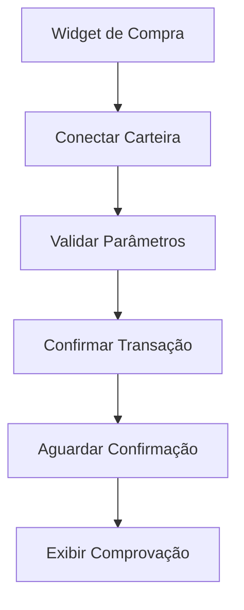

## 1. Product Overview

Widget de pagamento Web3 simplificado para compra de tokens personalizados. Interface minimalista que permite compra direta de tokens com informações básicas do contrato.

- Permite a qualquer usuário comprar tokens de contratos personalizados informando apenas endereço, valor e quantidade
- Realiza transação na blockchain e fornece comprovação da movimentação
- Ideal para testes e validação rápida de contratos de tokens

## 2. Core Features

### 2.1 User Roles

| Role        | Registration Method            | Core Permissions                      |
| ----------- | ------------------------------ | ------------------------------------- |
| Visitor     | No registration required       | Visualizar widget, conectar carteira  |
| Wallet User | Connect wallet (MetaMask, etc) | Comprar tokens, visualizar transações |

### 2.2 Feature Module

Nosso widget de pagamento Web3 simplificado consiste nos seguintes elementos principais:

1. **Widget de Compra**: campos de entrada, conexão de carteira, botão de compra
2. **Confirmação de Transação**: status da transação, hash da transação, link do explorador

### 2.3 Page Details

| Page Name        | Module Name           | Feature description                                                                          |
| ---------------- | --------------------- | -------------------------------------------------------------------------------------------- |
| Widget de Compra | Formulário de Entrada | Input para endereço do contrato, input para valor do token, input para quantidade desejada   |
| Widget de Compra | Conexão Wallet        | Botão para conectar MetaMask ou outra carteira Web3, exibir endereço conectado e saldo       |
| Widget de Compra | Botão Compra          | Executar transação na blockchain com os parâmetros informados, validar saldo antes da compra |
| Confirmação      | Status Transação      | Exibir loading durante processamento, mostrar sucesso/erro após confirmação                  |
| Confirmação      | Comprovação           | Exibir hash da transação, link para explorador de blocos, valores da transação realizada     |

## 3. Core Process

**Fluxo de Compra de Tokens:**

1. Usuário informa endereço do contrato, valor do token e quantidade
2. Conecta carteira Web3 (MetaMask)
3. Sistema valida saldo e parâmetros da transação
4. Usuário confirma transação na carteira
5. Sistema aguarda confirmação na blockchain
6. Exibe comprovação com hash e link do explorador

## 4. User Interface Design

### 4.1 Design Style

- **Cores**: Fundo branco, botões azuis (#3B82F6), textos cinza escuro (#374151)
- **Botões**: Estilo arredondado com hover effect, primário azul, secundário cinza
- **Fontes**: Inter ou system-ui, títulos 18px, texto 14px
- **Layout**: Card centralizado com sombra suave, máximo 400px de largura
- **Ícones**: Lucide React ou similar, minimalistas e outline

### 4.2 Page Design Overview

| Page Name        | Module Name    | UI Elements                                                                              |
| ---------------- | -------------- | ---------------------------------------------------------------------------------------- |
| Widget de Compra | Formulário     | Inputs com labels, placeholders descritivos, bordas arredondadas, validação visual       |
| Widget de Compra | Wallet Connect | Botão prominente com ícone de carteira, mostrar endereço truncado e saldo após conexão   |
| Widget de Compra | Botão Compra   | Botão grande e primário, desabilitado até formulário válido e carteira conectada         |
| Confirmação      | Status         | Spinner animado durante processamento, ícones de sucesso/erro, mensagens claras          |
| Confirmação      | Detalhes       | Card com hash da transação (truncado), link clicável para explorador, valores formatados |

### 4.3 Responsiveness

- Desktop-first com adaptação mobile
- Layout fluido que se ajusta a diferentes tamanhos de tela
- Touch-optimized para dispositivos móveis com botões maiores
