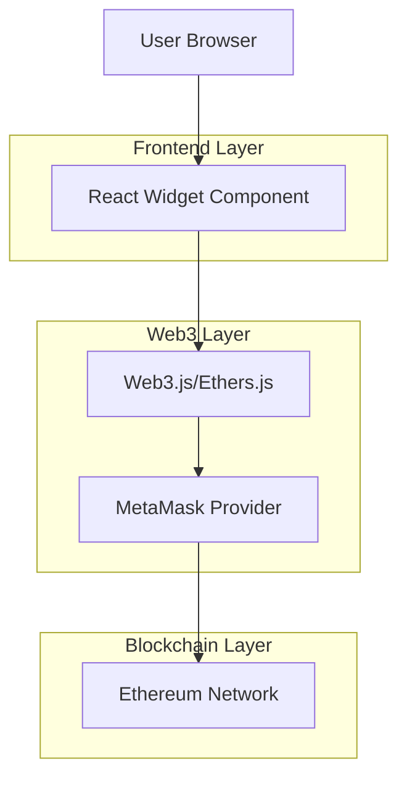
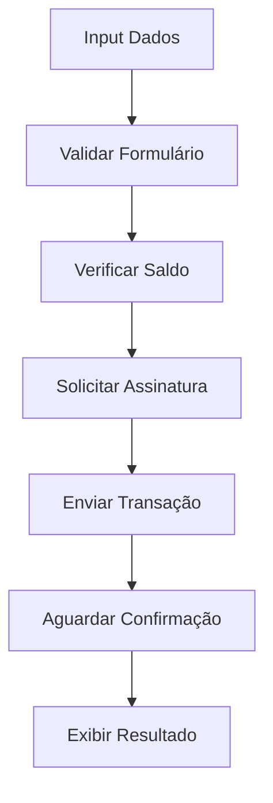

## 1.Architecture design



## 2.Technology Description

- Frontend: React\@18 + tailwindcss\@3 + vite

- Initialization Tool: vite-init

- Web3 Library: ethers.js\@6

- Backend: None (interação direta com blockchain)

- Wallet Provider: MetaMask e Web3Modal

## 3.Route definitions

| Route                    | Purpose                              |
| ------------------------ | ------------------------------------ |
| /widget-simples          | Página principal do widget de compra |
| /widget-simples/embedded | Versão embeddable do widget          |

## 4.Core Components

### 4.1 Componente Principal (WidgetSimples)

```typescript
interface WidgetSimplesProps {
  contractAddress?: string;
  tokenValue?: string;
  quantity?: string;
  onTransactionComplete?: (hash: string) => void;
}

interface TransactionState {
  status: "idle" | "connecting" | "pending" | "success" | "error";
  hash?: string;
  error?: string;
}
```

### 4.2 Funções Web3 Essenciais

**Conectar Carteira:**

```typescript
async function connectWallet(): Promise<string> {
  if (!window.ethereum) throw new Error("MetaMask não detectado");
  const provider = new ethers.BrowserProvider(window.ethereum);
  const accounts = await provider.send("eth_requestAccounts", []);
  return accounts[0];
}
```

**Executar Compra de Tokens:**

```typescript
async function buyTokens(contractAddress: string, tokenValue: bigint, quantity: bigint): Promise<string> {
  const provider = new ethers.BrowserProvider(window.ethereum);
  const signer = await provider.getSigner();

  // Para contratos ERC-20 simples, enviar Ether diretamente
  const tx = await signer.sendTransaction({
    to: contractAddress,
    value: tokenValue * quantity,
  });

  await tx.wait();
  return tx.hash;
}
```

**Verificar Saldo:**

```typescript
async function getBalance(address: string): Promise<bigint> {
  const provider = new ethers.BrowserProvider(window.ethereum);
  return await provider.getBalance(address);
}
```

## 5.Estrutura do Projeto

```
widget-simples/
├── src/
│   ├── components/
│   │   ├── WidgetSimples.tsx
│   │   ├── TransactionStatus.tsx
│   │   └── WalletConnect.tsx
│   ├── hooks/
│   │   ├── useWeb3.ts
│   │   └── useTransaction.ts
│   ├── utils/
│   │   ├── web3.ts
│   │   └── formatters.ts
│   └── types/
│       └── index.ts
├── public/
│   └── index.html
├── package.json
└── vite.config.ts
```

## 6.Estados e Ciclo de Vida

### Estados do Widget:

- **Desconectado**: Formulário visível, botão de conectar carteira

- **Conectado**: Formulário ativo, mostra saldo e endereço

- **Processando**: Loading durante transação

- **Sucesso**: Mostra hash e link do explorador

- **Erro**: Mensagem de erro com opção de retry

### Ciclo de Transação:



## 7.Tratamento de Erros

**Erros Comuns e Mensagens:**

- MetaMask não detectado: "Por favor, instale o MetaMask"

- Saldo insuficiente: "Saldo insuficiente para esta transação"

- Transação rejeitada: "Transação cancelada pelo usuário"

- Contrato inválido: "Endereço do contrato inválido"

- Rede incorreta: "Por favor, conecte-se à rede Ethereum"

**Fallback para erros:**

```typescript
try {
  // Operação Web3
} catch (error: any) {
  if (error.code === "INSUFFICIENT_FUNDS") {
    return { error: "Saldo insuficiente" };
  }
  if (error.code === "USER_REJECTED") {
    return { error: "Transação cancelada" };
  }
  return { error: "Erro desconhecido: " + error.message };
}
```

## 8.Integração com Sistema Existente

**Reutilização de Componentes:**

- Wallet connector do sistema principal

- Funções de formatação de valores

- Estilos e tema existente

- Configuração de redes e RPC

**Interface com Sistema Principal:**

```typescript
interface WidgetIntegration {
  theme: "light" | "dark";
  onComplete?: (hash: string) => void;
  onError?: (error: string) => void;
}
```
