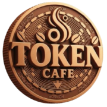

# TokenCafe - Plataforma Brasileira de Tokenização Web3



## 🎯 Visão Geral

TokenCafe é uma plataforma Web3 completa que democratiza a criação, gestão e negociação de tokens sem conhecimento técnico. Nossa missão é tornar a tokenização acessível para todos os brasileiros através de uma interface simples, segura e em português.

## 🧭 Diretrizes para IA/Copilot

- Consulte sempre `agents.json` e `.github/copilot-instructions.md` ao contribuir ou gerar código.
- Todas as mensagens e commits devem ser em **português do Brasil**.
- Use exclusivamente módulos unificados em `js/shared/` e evite scripts inline.
- CSS deve ficar somente em `css/styles.css` (sem arquivos extras).

## ✨ Funcionalidades Principais

### 🚀 Criação No-Code de Tokens
- **ERC-20 & ERC-721**: Crie tokens e NFTs sem programar
- **Templates Prontos**: Modelos pré-auditados para diferentes casos de uso
- **Deploy Instantâneo**: Publique seu token em minutos
- **Multi-blockchain**: Suporte a Ethereum, BSC, Polygon e mais

### 🎨 Landing Pages Automáticas
- **Geração Automática**: Páginas profissionais criadas automaticamente
- **Widget de Compra**: Sistema integrado de vendas
- **Personalização**: Customize cores, textos e imagens
- **SEO Otimizado**: Páginas otimizadas para buscadores

### 🤝 Marketplace Social
- **Descoberta de Projetos**: Explore tokens criados na comunidade
- **Interação Social**: Curtir, comentar e compartilhar projetos
- **Reputação**: Sistema de avaliação baseado em comunidade
- **Trending**: Acompanhe projetos em alta

### 🧠 IA Assistiva
- **Orientação Personalizada**: Suporte inteligente em todas as etapas
- **Análise de Mercado**: Insights sobre tendências e oportunidades
- **Otimização Automática**: Sugestões para melhorar seu projeto
- **Suporte 24/7**: Assistente sempre disponível

### 🔐 Segurança & Web3
- **Carteiras Conectadas**: MetaMask, Trust Wallet, WalletConnect
- **Custódia do Usuário**: Você mantém controle total dos seus ativos
- **Contratos Auditados**: Smart contracts verificados e seguros
- **Transparência Total**: Todas as transações na blockchain

## 🏗️ Arquitetura Técnica

### Frontend
- **JavaScript ES6 Vanilla**: Performance otimizada
- **Bootstrap 5**: Interface responsiva e moderna
- **Sistema Modular**: Arquitetura escalável e manutenível
- **PWA Ready**: Funciona como aplicativo nativo

### Backend
- **Flask Python**: API robusta e escalável  
- **Node.js Opcional**: Suporte dual de backend
- **WebSocket**: Atualizações em tempo real
- **RESTful APIs**: Integração com sistemas externos

### Blockchain
- **Web3.js**: Integração direta com blockchains
- **Multi-chain**: Ethereum, BSC, Polygon, Solana
- **Smart Contracts**: Solidity auditado e otimizado
- **Oráculos**: Dados do mundo real via Chainlink

### Dados
- **JSON Estruturado**: Sistema de dados flexível
- **IPFS**: Armazenamento descentralizado
- **Caching Inteligente**: Performance otimizada
- **Backup Automático**: Segurança de dados garantida

## 🚀 Como Começar

### Pré-requisitos
- Python 3.8+ ou Node.js 16+
- MetaMask ou carteira Web3
- Conexão com internet

### Instalação Rápida

```bash
# Clone o repositório
git clone https://github.com/andreval74/tokencafe.git
cd tokencafe

# Instale dependências Python
pip install -r requirements.txt

# OU Node.js
npm install

# Inicie o servidor
python server_flask.py
# OU
npm run dev

# Acesse: http://localhost:3001
```

### Configuração

1. **Configure sua carteira Web3**
2. **Escolha a rede blockchain**
3. **Crie seu primeiro token**
4. **Personalize sua landing page**
5. **Compartilhe com a comunidade**

## 📁 Estrutura do Projeto

```
tokencafe/
├── css/                 # Estilos unificados
├── js/                  # JavaScript modular
│   ├── core/           # Sistemas centrais
│   ├── shared/         # Módulos compartilhados  
│   ├── modules/        # Funcionalidades específicas
│   └── systems/        # Lógica de negócio
├── pages/              # Páginas HTML
├── shared/             # Dados e templates
├── imgs/               # Imagens e assets
├── index.html          # Página principal
├── server_flask.py     # Servidor Python
└── package.json        # Dependências Node.js
```

## 🛠️ Desenvolvimento

### Comandos Úteis

```bash
# Servidor de desenvolvimento
python server_flask.py

# Testes automatizados  
npm test

# Build para produção
npm run build

# Linting de código
npm run lint
```

### Padrões de Código

- **ES6 Modules**: Sistema modular JavaScript
- **CSS Variables**: Tema unificado e customizável
- **Bootstrap Classes**: Interface consistente
- **Sem Inline Styles**: Manutenção facilitada

## 🤝 Contribuindo

1. Fork o projeto
2. Crie uma branch (`git checkout -b feature/nova-funcionalidade`)
3. Commit suas mudanças (`git commit -m 'Adiciona nova funcionalidade'`)
4. Push para a branch (`git push origin feature/nova-funcionalidade`)
5. Abra um Pull Request

## 📄 Licença

Este projeto está licenciado sob a MIT License - veja o arquivo [LICENSE](LICENSE) para detalhes.

## 🔗 Links Úteis

- **Website**: [tokencafe.com](https://tokencafe.com)
- **Documentação**: [docs.tokencafe.com](https://docs.tokencafe.com)
- **Discord**: [TokenCafe Community](https://discord.gg/tokencafe)
- **Twitter**: [@TokenCafeBR](https://twitter.com/TokenCafeBR)

## 🚀 Roadmap

- [x] ✅ **Criação No-Code de Tokens**
- [x] ✅ **Landing Pages Automáticas**
- [x] ✅ **Integração Web3**
- [ ] 🔄 **Marketplace Social** (Em desenvolvimento)
- [ ] 🔄 **IA Assistiva** (Em desenvolvimento)
- [ ] 📋 **DEX Integrado** (Planejado)
- [ ] 📋 **Mobile Apps** (Planejado)

---

**TokenCafe** - Democratizando a Web3 para o Brasil 🇧🇷