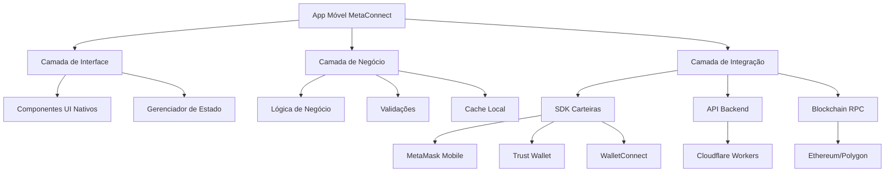
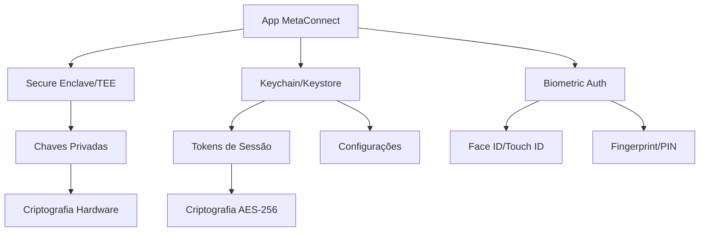

# Aplicativo Móvel MetaConnect - Documentação Técnica

## 1. Análise das Limitações do Sistema Web Atual

### 1.1 Problemas Identificados
- **Dependência de Navegadores**: O sistema atual requer navegadores com suporte a Web3, limitando a experiência mobile
- **Integração Limitada**: Dificuldade para integrar com carteiras móveis nativas
- **Performance**: Carregamento mais lento comparado a apps nativos
- **Funcionalidades Móveis**: Ausência de recursos como notificações push, acesso à câmera otimizado, e deep links
- **UX Inconsistente**: Interface não otimizada para diferentes tamanhos de tela móvel

### 1.2 Limitações Técnicas
- Impossibilidade de acesso direto às carteiras instaladas no dispositivo
- Dependência de WalletConnect para comunicação com carteiras externas
- Limitações de armazenamento local do navegador
- Restrições de segurança do ambiente web

## 2. Arquitetura Proposta para App Nativo

### 2.1 Visão Geral da Arquitetura



### 2.2 Componentes Principais

| Componente | Responsabilidade | Tecnologia |
|------------|------------------|------------|
| Interface Nativa | UI/UX otimizada para mobile | React Native/Flutter |
| Gerenciador de Carteiras | Integração com carteiras móveis | SDKs nativos |
| Cache Inteligente | Armazenamento offline de dados | SQLite/Realm |
| Notificações | Push notifications para transações | Firebase/APNs |
| Segurança | Criptografia e proteção de dados | Keychain/Keystore |

## 3. Tecnologias Recomendadas

### 3.1 Comparação de Frameworks

| Framework | Vantagens | Desvantagens | Recomendação |
|-----------|-----------|--------------|-------------|
| **React Native** | - Reutilização de código<br>- Comunidade ativa Web3<br>- Performance boa | - Dependência de bridges<br>- Tamanho do app | ⭐⭐⭐⭐⭐ |
| **Flutter** | - Performance nativa<br>- UI consistente | - Menos bibliotecas Web3<br>- Curva de aprendizado | ⭐⭐⭐⭐ |
| **Nativo (Swift/Kotlin)** | - Performance máxima<br>- Acesso completo às APIs | - Desenvolvimento duplo<br>- Maior custo | ⭐⭐⭐ |

### 3.2 Stack Tecnológico Recomendado

**Frontend Mobile:**
- React Native 0.73+
- TypeScript
- React Navigation 6
- React Query (TanStack Query)
- Zustand (gerenciamento de estado)

**Integração Web3:**
- @walletconnect/react-native
- ethers.js ou web3.js
- @react-native-async-storage/async-storage

**UI/UX:**
- React Native Elements ou NativeBase
- React Native Reanimated 3
- React Native Gesture Handler

**Segurança:**
- react-native-keychain
- react-native-biometrics
- react-native-crypto

## 4. Integração com Carteiras Móveis

### 4.1 Estratégias de Integração

#### MetaMask Mobile
```typescript
// Exemplo de integração direta
import { MetaMaskSDK } from '@metamask/sdk-react-native';

const sdk = new MetaMaskSDK({
  dappMetadata: {
    name: 'MetaConnect Mobile',
    url: 'https://metaconnect.app',
  },
});

const connectWallet = async () => {
  try {
    const accounts = await sdk.connect();
    return accounts;
  } catch (error) {
    console.error('Erro ao conectar:', error);
  }
};
```

#### WalletConnect v2
```typescript
// Configuração WalletConnect
import { WalletConnectModal } from '@walletconnect/modal-react-native';

const walletConnectConfig = {
  projectId: 'YOUR_PROJECT_ID',
  metadata: {
    name: 'MetaConnect',
    description: 'Intermediação entre carteiras Web3',
    url: 'https://metaconnect.app',
    icons: ['https://metaconnect.app/icon.png'],
  },
};
```

### 4.2 Carteiras Suportadas

| Carteira | Método de Integração | Funcionalidades |
|----------|---------------------|----------------|
| MetaMask Mobile | SDK Nativo | Conexão direta, transações |
| Trust Wallet | WalletConnect + Deep Links | Conexão via protocolo |
| Rainbow Wallet | WalletConnect | Conexão via protocolo |
| Coinbase Wallet | SDK + WalletConnect | Conexão híbrida |
| Phantom (Solana) | SDK Nativo | Suporte multi-chain |

## 5. Funcionalidades Específicas para Mobile

### 5.1 QR Code Scanner
```typescript
// Implementação de scanner QR
import { RNCamera } from 'react-native-camera';

const QRScanner = () => {
  const onBarCodeRead = (scanResult: any) => {
    if (scanResult.data) {
      // Processar dados do QR (endereço, WalletConnect URI, etc.)
      handleQRData(scanResult.data);
    }
  };

  return (
    <RNCamera
      onBarCodeRead={onBarCodeRead}
      barCodeTypes={[RNCamera.Constants.BarCodeType.qr]}
    />
  );
};
```

### 5.2 Deep Links
```typescript
// Configuração de deep links
const linking = {
  prefixes: ['metaconnect://', 'https://app.metaconnect.com'],
  config: {
    screens: {
      Connect: 'connect/:uri',
      Transaction: 'tx/:hash',
      Wallet: 'wallet/:address',
    },
  },
};
```

### 5.3 Notificações Push
```typescript
// Sistema de notificações
import messaging from '@react-native-firebase/messaging';

const setupNotifications = async () => {
  const authStatus = await messaging().requestPermission();
  
  if (authStatus === messaging.AuthorizationStatus.AUTHORIZED) {
    const token = await messaging().getToken();
    // Enviar token para backend
    await registerDeviceToken(token);
  }
};
```

## 6. Considerações de UX/UI para Mobile

### 6.1 Design Principles
- **Mobile-First**: Interface projetada especificamente para telas pequenas
- **Gestos Intuitivos**: Swipe, pinch-to-zoom, pull-to-refresh
- **Feedback Tátil**: Vibração para confirmações e alertas
- **Modo Escuro**: Suporte nativo a temas claro/escuro
- **Acessibilidade**: Suporte a leitores de tela e navegação por voz

### 6.2 Componentes UI Específicos

| Componente | Funcionalidade | Implementação |
|------------|----------------|---------------|
| **Bottom Sheet** | Modais deslizantes | react-native-bottom-sheet |
| **Tab Navigation** | Navegação principal | @react-navigation/bottom-tabs |
| **Floating Action** | Ações rápidas | react-native-paper |
| **Swipe Cards** | Carteiras/tokens | react-native-deck-swiper |
| **Biometric Auth** | Autenticação segura | react-native-biometrics |

### 6.3 Responsividade
```typescript
// Sistema de breakpoints para mobile
const screenSizes = {
  small: 320,   // iPhone SE
  medium: 375,  // iPhone 12
  large: 414,   // iPhone 12 Pro Max
  tablet: 768,  // iPad
};

const useResponsive = () => {
  const { width } = useWindowDimensions();
  
  return {
    isSmall: width <= screenSizes.small,
    isMedium: width <= screenSizes.medium,
    isLarge: width <= screenSizes.large,
    isTablet: width >= screenSizes.tablet,
  };
};
```

## 7. Segurança e Gerenciamento de Chaves

### 7.1 Arquitetura de Segurança



### 7.2 Implementação de Segurança

```typescript
// Gerenciamento seguro de chaves
import Keychain from 'react-native-keychain';
import { encrypt, decrypt } from 'react-native-crypto-js';

class SecureStorage {
  static async storePrivateKey(key: string, password: string) {
    const encryptedKey = encrypt(key, password);
    await Keychain.setInternetCredentials(
      'metaconnect_wallet',
      'private_key',
      encryptedKey
    );
  }
  
  static async getPrivateKey(password: string) {
    const credentials = await Keychain.getInternetCredentials('metaconnect_wallet');
    if (credentials) {
      return decrypt(credentials.password, password);
    }
    return null;
  }
}
```

### 7.3 Medidas de Proteção

| Aspecto | Implementação | Tecnologia |
|---------|---------------|------------|
| **Armazenamento** | Keychain/Keystore nativo | iOS Keychain, Android Keystore |
| **Criptografia** | AES-256 + Hardware Security | Secure Enclave, TEE |
| **Autenticação** | Biometria + PIN | Face ID, Touch ID, Fingerprint |
| **Comunicação** | TLS 1.3 + Certificate Pinning | SSL Pinning |
| **Detecção** | Root/Jailbreak detection | react-native-root-detection |

## 8. Estratégia de Deploy nas App Stores

### 8.1 Preparação para App Store (iOS)

**Requisitos:**
- Conta Apple Developer ($99/ano)
- Certificados de desenvolvimento e distribuição
- Provisioning profiles
- App Store Connect configurado

**Processo:**
1. Configurar Bundle ID único
2. Gerar certificados de distribuição
3. Criar app no App Store Connect
4. Upload via Xcode ou Transporter
5. Submeter para revisão

### 8.2 Preparação para Google Play (Android)

**Requisitos:**
- Conta Google Play Console ($25 taxa única)
- Chave de assinatura do app
- AAB (Android App Bundle)

**Processo:**
1. Gerar chave de upload
2. Criar listing no Play Console
3. Upload do AAB
4. Configurar releases (internal → alpha → beta → production)
5. Submeter para revisão

### 8.3 Configurações Específicas Web3

```json
// iOS Info.plist
{
  "LSApplicationQueriesSchemes": [
    "metamask",
    "trust",
    "rainbow",
    "coinbase"
  ],
  "CFBundleURLTypes": [
    {
      "CFBundleURLName": "metaconnect",
      "CFBundleURLSchemes": ["metaconnect"]
    }
  ]
}
```

```xml
<!-- Android AndroidManifest.xml -->
<activity
    android:name=".MainActivity"
    android:exported="true"
    android:launchMode="singleTop">
    <intent-filter>
        <action android:name="android.intent.action.VIEW" />
        <category android:name="android.intent.category.DEFAULT" />
        <category android:name="android.intent.category.BROWSABLE" />
        <data android:scheme="metaconnect" />
    </intent-filter>
</activity>
```

## 9. Comparação de Custos e Complexidade

### 9.1 Análise de Custos

| Item | Web App | React Native | Flutter | Nativo |
|------|---------|--------------|---------|--------|
| **Desenvolvimento** | $15k-25k | $25k-40k | $30k-45k | $50k-80k |
| **Manutenção/ano** | $5k-8k | $8k-12k | $10k-15k | $15k-25k |
| **Deploy** | $0 | $124/ano | $124/ano | $124/ano |
| **Infraestrutura** | $50-200/mês | $50-200/mês | $50-200/mês | $50-200/mês |

### 9.2 Complexidade de Desenvolvimento

| Aspecto | Web | React Native | Flutter | Nativo |
|---------|-----|--------------|---------|--------|
| **Curva de Aprendizado** | ⭐⭐ | ⭐⭐⭐ | ⭐⭐⭐⭐ | ⭐⭐⭐⭐⭐ |
| **Integração Web3** | ⭐⭐⭐⭐⭐ | ⭐⭐⭐⭐ | ⭐⭐⭐ | ⭐⭐ |
| **Performance** | ⭐⭐⭐ | ⭐⭐⭐⭐ | ⭐⭐⭐⭐⭐ | ⭐⭐⭐⭐⭐ |
| **Manutenção** | ⭐⭐⭐⭐⭐ | ⭐⭐⭐⭐ | ⭐⭐⭐ | ⭐⭐ |
| **Time to Market** | ⭐⭐⭐⭐⭐ | ⭐⭐⭐⭐ | ⭐⭐⭐ | ⭐⭐ |

### 9.3 Recomendação Final

**Para MetaConnect Mobile, recomendamos React Native pelos seguintes motivos:**

✅ **Vantagens:**
- Reutilização de 70-80% do código existente
- Ecossistema Web3 maduro
- Performance adequada para o caso de uso
- Comunidade ativa e suporte
- Menor custo de desenvolvimento

⚠️ **Considerações:**
- Necessidade de conhecimento específico em mobile
- Dependência de bibliotecas terceiras
- Possíveis limitações em funcionalidades muito específicas

## 10. Roadmap de Implementação

### Fase 1: MVP (2-3 meses)
- Setup do projeto React Native
- Integração básica com MetaMask Mobile
- Interface principal (conectar, visualizar saldo)
- QR Code scanner básico

### Fase 2: Funcionalidades Core (2-3 meses)
- Integração com múltiplas carteiras
- Sistema de notificações
- Cache offline
- Biometria e segurança

### Fase 3: Otimizações (1-2 meses)
- Performance tuning
- Testes extensivos
- Preparação para app stores
- Deploy beta

### Fase 4: Produção (1 mês)
- Deploy nas app stores
- Monitoramento e analytics
- Suporte e manutenção

**Custo Total Estimado: $30k-45k**
**Tempo Total: 6-9 meses**
**Equipe Recomendada: 2-3 desenvolvedores + 1 designer**