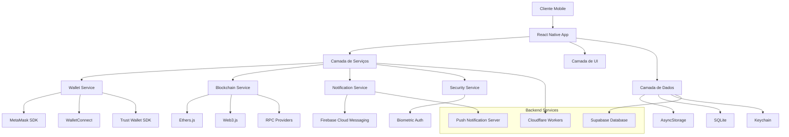
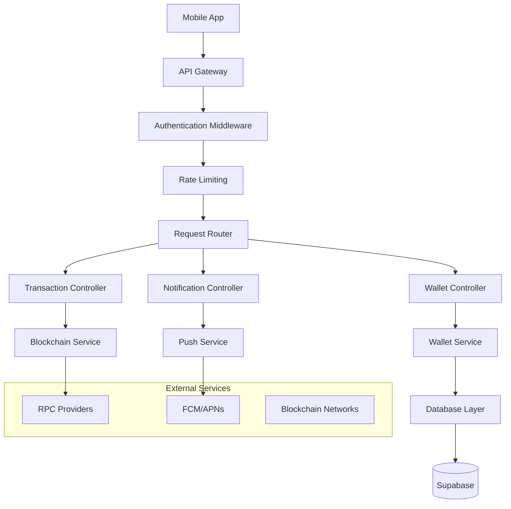
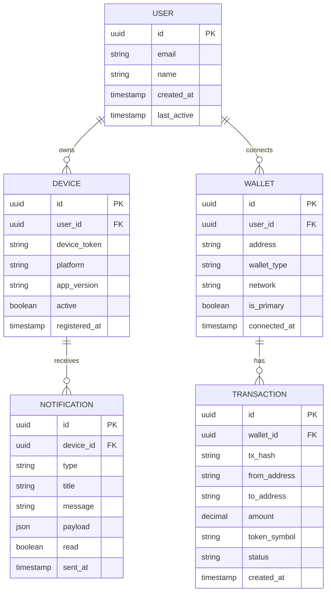

# MetaConnect Mobile - Arquitetura Técnica

## 1. Arquitetura Geral do Sistema



## 2. Descrição das Tecnologias

### Frontend Mobile
- **React Native**: 0.73.x
- **TypeScript**: 5.x
- **React Navigation**: 6.x (navegação)
- **Zustand**: 4.x (gerenciamento de estado)
- **React Query**: 5.x (cache e sincronização de dados)
- **React Native Reanimated**: 3.x (animações)

### Integração Web3
- **@metamask/sdk-react-native**: SDK oficial MetaMask
- **@walletconnect/react-native-v2**: Protocolo WalletConnect
- **ethers**: 6.x (interação blockchain)
- **@react-native-async-storage/async-storage**: Armazenamento local

### Segurança e Autenticação
- **react-native-keychain**: Armazenamento seguro
- **react-native-biometrics**: Autenticação biométrica
- **react-native-crypto**: Criptografia

### UI/UX
- **react-native-elements**: Componentes UI
- **react-native-vector-icons**: Ícones
- **react-native-camera**: Scanner QR
- **react-native-gesture-handler**: Gestos

### Backend (Reutilizado)
- **Cloudflare Workers**: API backend existente
- **Supabase**: Banco de dados e autenticação

## 3. Definições de Rotas Mobile

| Rota | Propósito | Componente |
|------|-----------|------------|
| `/` | Tela inicial com opções de conexão | HomeScreen |
| `/connect` | Seleção e conexão de carteiras | ConnectWalletScreen |
| `/wallet/:address` | Detalhes da carteira conectada | WalletDetailsScreen |
| `/scan` | Scanner de QR codes | QRScannerScreen |
| `/transaction/:hash` | Detalhes de transação | TransactionScreen |
| `/settings` | Configurações do app | SettingsScreen |
| `/security` | Configurações de segurança | SecurityScreen |
| `/networks` | Gerenciamento de redes | NetworksScreen |

## 4. APIs e Integrações

### 4.1 APIs Internas (Reutilizadas do sistema web)

#### Busca de Redes
```typescript
GET /api/networks/search?query={network_name}
```

Request:
| Parâmetro | Tipo | Obrigatório | Descrição |
|-----------|------|-------------|----------|
| query | string | true | Nome da rede para busca |

Response:
```json
{
  "networks": [
    {
      "id": "ethereum",
      "name": "Ethereum Mainnet",
      "chainId": 1,
      "rpcUrl": "https://eth.llamarpc.com",
      "symbol": "ETH"
    }
  ]
}
```

#### Informações de Contratos
```typescript
POST /api/contracts/info
```

Request:
| Parâmetro | Tipo | Obrigatório | Descrição |
|-----------|------|-------------|----------|
| address | string | true | Endereço do contrato |
| chainId | number | true | ID da rede |

Response:
```json
{
  "contract": {
    "address": "0x...",
    "name": "USDC",
    "symbol": "USDC",
    "decimals": 6,
    "type": "ERC20"
  }
}
```

### 4.2 APIs Específicas Mobile

#### Registro de Device Token
```typescript
POST /api/mobile/register-device
```

Request:
| Parâmetro | Tipo | Obrigatório | Descrição |
|-----------|------|-------------|----------|
| deviceToken | string | true | Token FCM/APNs |
| platform | string | true | 'ios' ou 'android' |
| walletAddress | string | false | Endereço da carteira |

#### Notificações de Transação
```typescript
POST /api/mobile/transaction-notification
```

Request:
| Parâmetro | Tipo | Obrigatório | Descrição |
|-----------|------|-------------|----------|
| txHash | string | true | Hash da transação |
| walletAddress | string | true | Endereço da carteira |
| type | string | true | 'sent', 'received', 'confirmed' |

## 5. Arquitetura do Servidor Mobile



## 6. Modelo de Dados Mobile

### 6.1 Definição do Modelo



### 6.2 DDL (Data Definition Language)

```sql
-- Tabela de Dispositivos Móveis
CREATE TABLE mobile_devices (
    id UUID PRIMARY KEY DEFAULT gen_random_uuid(),
    user_id UUID REFERENCES users(id) ON DELETE CASCADE,
    device_token VARCHAR(255) UNIQUE NOT NULL,
    platform VARCHAR(20) NOT NULL CHECK (platform IN ('ios', 'android')),
    app_version VARCHAR(20),
    device_info JSONB,
    active BOOLEAN DEFAULT true,
    registered_at TIMESTAMP WITH TIME ZONE DEFAULT NOW(),
    last_seen TIMESTAMP WITH TIME ZONE DEFAULT NOW()
);

-- Tabela de Carteiras Conectadas
CREATE TABLE connected_wallets (
    id UUID PRIMARY KEY DEFAULT gen_random_uuid(),
    user_id UUID REFERENCES users(id) ON DELETE CASCADE,
    address VARCHAR(42) NOT NULL,
    wallet_type VARCHAR(50) NOT NULL, -- 'metamask', 'trust', 'coinbase'
    network_id INTEGER NOT NULL,
    network_name VARCHAR(100),
    is_primary BOOLEAN DEFAULT false,
    balance_cache JSONB,
    connected_at TIMESTAMP WITH TIME ZONE DEFAULT NOW(),
    last_sync TIMESTAMP WITH TIME ZONE DEFAULT NOW()
);

-- Tabela de Transações Monitoradas
CREATE TABLE monitored_transactions (
    id UUID PRIMARY KEY DEFAULT gen_random_uuid(),
    wallet_id UUID REFERENCES connected_wallets(id) ON DELETE CASCADE,
    tx_hash VARCHAR(66) UNIQUE NOT NULL,
    from_address VARCHAR(42),
    to_address VARCHAR(42),
    amount DECIMAL(36, 18),
    token_address VARCHAR(42),
    token_symbol VARCHAR(20),
    network_id INTEGER,
    status VARCHAR(20) DEFAULT 'pending',
    block_number BIGINT,
    gas_used BIGINT,
    gas_price DECIMAL(36, 18),
    created_at TIMESTAMP WITH TIME ZONE DEFAULT NOW(),
    confirmed_at TIMESTAMP WITH TIME ZONE
);

-- Tabela de Notificações Push
CREATE TABLE push_notifications (
    id UUID PRIMARY KEY DEFAULT gen_random_uuid(),
    device_id UUID REFERENCES mobile_devices(id) ON DELETE CASCADE,
    type VARCHAR(50) NOT NULL, -- 'transaction', 'security', 'update'
    title VARCHAR(100) NOT NULL,
    message TEXT NOT NULL,
    payload JSONB,
    read BOOLEAN DEFAULT false,
    sent_at TIMESTAMP WITH TIME ZONE DEFAULT NOW(),
    read_at TIMESTAMP WITH TIME ZONE
);

-- Índices para Performance
CREATE INDEX idx_mobile_devices_user_id ON mobile_devices(user_id);
CREATE INDEX idx_mobile_devices_token ON mobile_devices(device_token);
CREATE INDEX idx_connected_wallets_user_id ON connected_wallets(user_id);
CREATE INDEX idx_connected_wallets_address ON connected_wallets(address);
CREATE INDEX idx_monitored_transactions_wallet_id ON monitored_transactions(wallet_id);
CREATE INDEX idx_monitored_transactions_hash ON monitored_transactions(tx_hash);
CREATE INDEX idx_push_notifications_device_id ON push_notifications(device_id);
CREATE INDEX idx_push_notifications_sent_at ON push_notifications(sent_at DESC);

-- Políticas de Segurança (RLS)
ALTER TABLE mobile_devices ENABLE ROW LEVEL SECURITY;
ALTER TABLE connected_wallets ENABLE ROW LEVEL SECURITY;
ALTER TABLE monitored_transactions ENABLE ROW LEVEL SECURITY;
ALTER TABLE push_notifications ENABLE ROW LEVEL SECURITY;

-- Políticas para usuários autenticados
CREATE POLICY "Users can manage their own devices" ON mobile_devices
    FOR ALL USING (auth.uid() = user_id);

CREATE POLICY "Users can manage their own wallets" ON connected_wallets
    FOR ALL USING (auth.uid() = user_id);

CREATE POLICY "Users can view their own transactions" ON monitored_transactions
    FOR SELECT USING (
        wallet_id IN (
            SELECT id FROM connected_wallets WHERE user_id = auth.uid()
        )
    );

CREATE POLICY "Users can view their own notifications" ON push_notifications
    FOR ALL USING (
        device_id IN (
            SELECT id FROM mobile_devices WHERE user_id = auth.uid()
        )
    );

-- Dados Iniciais
INSERT INTO mobile_devices (user_id, device_token, platform, app_version)
VALUES 
    ('00000000-0000-0000-0000-000000000001', 'demo_ios_token', 'ios', '1.0.0'),
    ('00000000-0000-0000-0000-000000000002', 'demo_android_token', 'android', '1.0.0');

INSERT INTO connected_wallets (user_id, address, wallet_type, network_id, network_name)
VALUES 
    ('00000000-0000-0000-0000-000000000001', '0x742d35Cc6634C0532925a3b8D4C9db96C4b4d8b7', 'metamask', 1, 'Ethereum Mainnet'),
    ('00000000-0000-0000-0000-000000000002', '0x8ba1f109551bD432803012645Hac136c', 'trust', 137, 'Polygon Mainnet');
```

## 7. Configurações de Segurança

### 7.1 Armazenamento Seguro
```typescript
// Configuração do Keychain
import Keychain from 'react-native-keychain';

const KEYCHAIN_SERVICE = 'MetaConnectMobile';

export class SecureStorage {
  static async setItem(key: string, value: string): Promise<void> {
    await Keychain.setInternetCredentials(
      `${KEYCHAIN_SERVICE}_${key}`,
      key,
      value,
      {
        accessControl: Keychain.ACCESS_CONTROL.BIOMETRY_CURRENT_SET,
        authenticationType: Keychain.AUTHENTICATION_TYPE.DEVICE_PASSCODE_OR_SET_BIOMETRY,
      }
    );
  }
  
  static async getItem(key: string): Promise<string | null> {
    try {
      const credentials = await Keychain.getInternetCredentials(
        `${KEYCHAIN_SERVICE}_${key}`
      );
      return credentials ? credentials.password : null;
    } catch (error) {
      return null;
    }
  }
}
```

### 7.2 Criptografia de Dados
```typescript
// Utilitários de criptografia
import CryptoJS from 'crypto-js';
import { generateSecureRandom } from 'react-native-securerandom';

export class CryptoUtils {
  static async generateSalt(): Promise<string> {
    const randomBytes = await generateSecureRandom(32);
    return Array.from(randomBytes, byte => byte.toString(16).padStart(2, '0')).join('');
  }
  
  static encrypt(data: string, password: string, salt: string): string {
    const key = CryptoJS.PBKDF2(password, salt, {
      keySize: 256 / 32,
      iterations: 10000
    });
    
    return CryptoJS.AES.encrypt(data, key).toString();
  }
  
  static decrypt(encryptedData: string, password: string, salt: string): string {
    const key = CryptoJS.PBKDF2(password, salt, {
      keySize: 256 / 32,
      iterations: 10000
    });
    
    const bytes = CryptoJS.AES.decrypt(encryptedData, key);
    return bytes.toString(CryptoJS.enc.Utf8);
  }
}
```

## 8. Configurações de Deploy

### 8.1 Configuração iOS (ios/MetaConnect/Info.plist)
```xml
<?xml version="1.0" encoding="UTF-8"?>
<!DOCTYPE plist PUBLIC "-//Apple//DTD PLIST 1.0//EN" "http://www.apple.com/DTDs/PropertyList-1.0.dtd">
<plist version="1.0">
<dict>
    <key>CFBundleDisplayName</key>
    <string>MetaConnect</string>
    <key>CFBundleIdentifier</key>
    <string>com.metaconnect.mobile</string>
    <key>CFBundleVersion</key>
    <string>1.0.0</string>
    
    <!-- Deep Links -->
    <key>CFBundleURLTypes</key>
    <array>
        <dict>
            <key>CFBundleURLName</key>
            <string>metaconnect</string>
            <key>CFBundleURLSchemes</key>
            <array>
                <string>metaconnect</string>
            </array>
        </dict>
    </array>
    
    <!-- Wallet Apps Query -->
    <key>LSApplicationQueriesSchemes</key>
    <array>
        <string>metamask</string>
        <string>trust</string>
        <string>rainbow</string>
        <string>coinbase</string>
        <string>phantom</string>
    </array>
    
    <!-- Permissions -->
    <key>NSCameraUsageDescription</key>
    <string>Usado para escanear QR codes de carteiras</string>
    <key>NSFaceIDUsageDescription</key>
    <string>Usado para autenticação segura</string>
    
    <!-- Security -->
    <key>NSAppTransportSecurity</key>
    <dict>
        <key>NSAllowsArbitraryLoads</key>
        <false/>
        <key>NSExceptionDomains</key>
        <dict>
            <key>localhost</key>
            <dict>
                <key>NSExceptionAllowsInsecureHTTPLoads</key>
                <true/>
            </dict>
        </dict>
    </dict>
</dict>
</plist>
```

### 8.2 Configuração Android (android/app/src/main/AndroidManifest.xml)
```xml
<manifest xmlns:android="http://schemas.android.com/apk/res/android">
    
    <!-- Permissions -->
    <uses-permission android:name="android.permission.INTERNET" />
    <uses-permission android:name="android.permission.CAMERA" />
    <uses-permission android:name="android.permission.USE_BIOMETRIC" />
    <uses-permission android:name="android.permission.USE_FINGERPRINT" />
    
    <application
        android:name=".MainApplication"
        android:label="@string/app_name"
        android:icon="@mipmap/ic_launcher"
        android:allowBackup="false"
        android:theme="@style/AppTheme">
        
        <activity
            android:name=".MainActivity"
            android:exported="true"
            android:launchMode="singleTop"
            android:theme="@style/AppTheme">
            
            <intent-filter>
                <action android:name="android.intent.action.MAIN" />
                <category android:name="android.intent.category.LAUNCHER" />
            </intent-filter>
            
            <!-- Deep Links -->
            <intent-filter>
                <action android:name="android.intent.action.VIEW" />
                <category android:name="android.intent.category.DEFAULT" />
                <category android:name="android.intent.category.BROWSABLE" />
                <data android:scheme="metaconnect" />
            </intent-filter>
            
        </activity>
        
        <!-- Firebase Messaging -->
        <service
            android:name=".firebase.MyFirebaseMessagingService"
            android:exported="false">
            <intent-filter>
                <action android:name="com.google.firebase.MESSAGING_EVENT" />
            </intent-filter>
        </service>
        
    </application>
</manifest>
```

### 8.3 Scripts de Build
```json
{
  "scripts": {
    "android:build": "cd android && ./gradlew assembleRelease",
    "android:bundle": "cd android && ./gradlew bundleRelease",
    "ios:build": "xcodebuild -workspace ios/MetaConnect.xcworkspace -scheme MetaConnect -configuration Release -destination generic/platform=iOS -archivePath ios/build/MetaConnect.xcarchive archive",
    "ios:export": "xcodebuild -exportArchive -archivePath ios/build/MetaConnect.xcarchive -exportPath ios/build -exportOptionsPlist ios/ExportOptions.plist",
    "deploy:android": "npm run android:bundle && fastlane android deploy",
    "deploy:ios": "npm run ios:build && npm run ios:export && fastlane ios deploy"
  }
}
```

## 9. Monitoramento e Analytics

### 9.1 Configuração Firebase Analytics
```typescript
// Analytics service
import analytics from '@react-native-firebase/analytics';
import crashlytics from '@react-native-firebase/crashlytics';

export class AnalyticsService {
  static async trackEvent(eventName: string, parameters?: Record<string, any>) {
    await analytics().logEvent(eventName, parameters);
  }
  
  static async trackScreen(screenName: string) {
    await analytics().logScreenView({
      screen_name: screenName,
      screen_class: screenName,
    });
  }
  
  static async trackWalletConnection(walletType: string, success: boolean) {
    await analytics().logEvent('wallet_connection', {
      wallet_type: walletType,
      success,
      timestamp: Date.now(),
    });
  }
  
  static async trackTransaction(txHash: string, amount: string, token: string) {
    await analytics().logEvent('transaction_initiated', {
      tx_hash: txHash,
      amount,
      token,
      timestamp: Date.now(),
    });
  }
  
  static async recordError(error: Error, context?: string) {
    crashlytics().recordError(error);
    if (context) {
      crashlytics().setAttribute('context', context);
    }
  }
}
```

## 10. Performance e Otimizações

### 10.1 Lazy Loading de Componentes
```typescript
// Lazy loading para melhor performance
import { lazy, Suspense } from 'react';
import { ActivityIndicator } from 'react-native';

const WalletDetailsScreen = lazy(() => import('../screens/WalletDetailsScreen'));
const TransactionScreen = lazy(() => import('../screens/TransactionScreen'));

const LazyComponent = ({ component: Component, ...props }) => (
  <Suspense fallback={<ActivityIndicator size="large" />}>
    <Component {...props} />
  </Suspense>
);
```

### 10.2 Otimização de Imagens
```typescript
// Configuração para otimização de imagens
import FastImage from 'react-native-fast-image';

const OptimizedImage = ({ source, style, ...props }) => (
  <FastImage
    source={{
      uri: source,
      priority: FastImage.priority.normal,
      cache: FastImage.cacheControl.immutable,
    }}
    style={style}
    resizeMode={FastImage.resizeMode.contain}
    {...props}
  />
);
```

Esta arquitetura técnica fornece uma base sólida para o desenvolvimento do aplicativo móvel MetaConnect, garantindo escalabilidade, segurança e performance adequadas para um ambiente de produção.