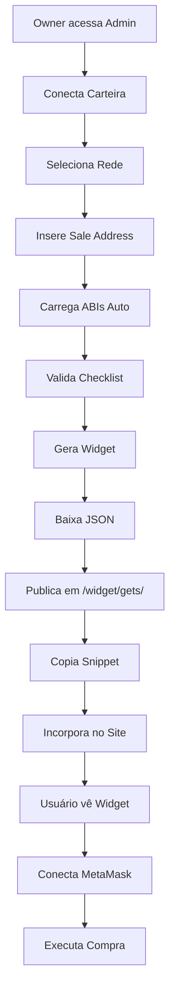

# Sistema de Widgets TokenCafe

Sistema completo de geração e incorporação de widgets de compra de tokens, com configuração via JSON e loader standalone.

## 📋 Visão Geral

O sistema permite que donos de projetos (owners) criem widgets personalizados de compra de tokens que podem ser incorporados em qualquer site externo, sem necessidade de backend próprio ou códigos complexos.

### Componentes Principais

```
widget/
├── gets/                          # Armazenamento de configurações JSON
│   └── <owner-checksum>/          # Pasta por endereço owner
│       └── <code>.json            # Arquivo de configuração de cada widget
│
pages/modules/widget/
├── widget-teste.html              # Interface admin (geração de widgets)
├── widget-demo.html               # Demo de incorporação
│
js/modules/widget/
├── widget_teste.js                # Lógica da interface admin
├── widget-generator.js            # Gerador de JSON e validação
│
assets/
└── tokencafe-widget.min.js        # Loader standalone (único script necessário)
```

---

## 🚀 Como Usar

### 1. Gerar Widget (Owner)

1. Abra a interface admin: `/pages/modules/widget/widget-teste.html`
2. **Conecte sua carteira** (você será o owner do widget)
3. **Selecione a rede** onde seu contrato Sale está implantado
4. **Preencha os dados**:
   - **Sale Contract** (obrigatório): Endereço do contrato de venda
   - **Receiver Wallet** (opcional): Carteira que receberá os fundos (auto-detecta se omitido)
   - **Token** (opcional): Endereço do token sendo vendido (auto-detecta se omitido)
5. **Carregue as ABIs**: Clique em "Carregar ABIs" para buscar automaticamente
6. **Valide**: Checklist deve marcar todos os itens como ✅
7. **Gere o Widget**: Clique em "Gerar Widget"
8. **Baixe o JSON**: Salve o arquivo `.json` gerado
9. **Copie o snippet**: Use o código HTML fornecido

### 2. Publicar JSON

Coloque o JSON baixado na pasta correta:

```
widget/gets/<seu-endereço-checksum>/<código-gerado>.json
```

**Exemplo:**
```
widget/gets/0x742d35Cc6634C0532925a3b844Bc9e7595f0bEb/tc-20250116-143522-abc123.json
```

> **Importante:** O endereço deve estar em formato checksum (maiúsculas/minúsculas corretas).

### 3. Incorporar no Site

Cole o snippet fornecido no HTML do seu site:

```html
<!-- Loader do widget (único script necessário) -->
<script src="https://seu-dominio.com/assets/tokencafe-widget.min.js" async></script>

<!-- Widget incorporado -->
<div class="tokencafe-widget" 
     data-owner="0x742d35Cc6634C0532925a3b844Bc9e7595f0bEb" 
     data-code="tc-20250116-143522-abc123">
</div>
```

**Pronto!** O widget carregará automaticamente quando a página for aberta.

---

## 📦 Schema JSON (v1)

Estrutura completa de um arquivo de configuração:

```json
{
  "schemaVersion": 1,
  "owner": "0x742d35Cc6634C0532925a3b844Bc9e7595f0bEb",
  "code": "tc-20250116-143522-abc123",
  "network": {
    "chainId": 97,
    "name": "BSC Testnet",
    "rpcUrl": "https://bsc-testnet.publicnode.com"
  },
  "contracts": {
    "sale": "0x1234...",
    "receiverWallet": "0x5678...",
    "token": "0x9abc..."
  },
  "purchase": {
    "functionName": "buy",
    "signature": "buy(uint256)",
    "argsMode": "quantity",
    "priceMode": "value"
  },
  "ui": {
    "theme": "light",
    "language": "pt-BR",
    "showTestButton": true,
    "currencySymbol": "tBNB",
    "texts": {
      "title": "Compre seus Tokens",
      "description": "Finalize sua compra com segurança",
      "buyButton": "Comprar Agora"
    }
  },
  "advanced": {
    "minAbi": {
      "sale": ["function buy(uint256) payable"],
      "token": ["function symbol() view returns (string)"]
    }
  },
  "meta": {
    "createdAt": "2025-01-16T14:35:22.000Z",
    "updatedAt": "2025-01-16T14:35:22.000Z",
    "createdBy": "widget-teste.html"
  }
}
```

### Campos Principais

| Campo | Tipo | Obrigatório | Descrição |
|-------|------|-------------|-----------|
| `schemaVersion` | number | ✅ | Versão do schema (atualmente 1) |
| `owner` | address | ✅ | Endereço owner (checksum) |
| `code` | string | ✅ | Código único do widget (tc-YYYYMMDD-HHmmss-random) |
| `network.chainId` | number | ✅ | Chain ID da rede blockchain |
| `network.rpcUrl` | string | ✅ | URL do RPC para conexão |
| `contracts.sale` | address | ✅ | Contrato de venda (Sale) |
| `contracts.receiverWallet` | address | ✅ | Carteira que recebe os fundos |
| `contracts.token` | address | ❌ | Token sendo vendido (opcional) |
| `purchase.functionName` | string | ✅ | Nome da função de compra (ex: "buy") |
| `purchase.argsMode` | enum | ✅ | Tipo de argumento: "none", "quantity", "value" |
| `ui.theme` | string | ❌ | Tema visual: "light" ou "dark" |
| `ui.showTestButton` | boolean | ❌ | Exibir botão de teste (estimateGas) |

---

## 🎨 Personalização do Widget

### Textos

Customize os textos através do campo `ui.texts`:

```json
"ui": {
  "texts": {
    "title": "Seu título personalizado",
    "description": "Descrição do seu projeto",
    "buyButton": "Texto do botão"
  }
}
```

### Temas

Escolha entre `light` (padrão) e `dark`:

```json
"ui": {
  "theme": "dark"
}
```

### Idiomas

Atualmente suporta `pt-BR` (português) e `en-US` (inglês):

```json
"ui": {
  "language": "en-US"
}
```

---

## 🔧 Auto-Detecção

O sistema tenta **auto-detectar** informações quando possível:

1. **ABIs**: Busca via Sourcify ou BSCScan API
2. **Receiver Wallet**: Chama `destinationWallet()` no contrato Sale
3. **Token**: Chama `saleToken()` no contrato Sale
4. **Função de Compra**: Detecta automaticamente funções payable (buy, purchase, mint, etc.)
5. **Decimais**: Busca via `decimals()` no token

> **Dica:** Para melhor resultado, forneça todas as informações manualmente ao gerar.

---

## 🧪 Testando

### 1. Teste Admin (Interface de Geração)

1. Acesse `/pages/modules/widget/widget-teste.html`
2. Configure e gere um widget
3. Verifique o **Preview** na coluna direita
4. Use o botão **🧪 Testar** para validar com `estimateGas`

### 2. Teste Externo (Incorporação)

1. Acesse `/pages/modules/widget/widget-demo.html`
2. Veja o widget carregado dinamicamente
3. Conecte MetaMask e teste uma compra real

### 3. Teste Manual (Criar HTML)

Crie um arquivo `test.html`:

```html
<!DOCTYPE html>
<html>
<head>
  <title>Meu Widget</title>
</head>
<body>
  <h1>Compre Tokens</h1>
  
  <div class="tokencafe-widget" 
       data-owner="0xSEU_ENDERECO" 
       data-code="tc-...">
  </div>
  
  <script src="/assets/tokencafe-widget.min.js" async></script>
</body>
</html>
```

---

## 🛡️ Segurança

### O que é exposto

- ✅ Endereço owner (público na blockchain)
- ✅ Código do widget (não-sensível)
- ✅ JSON de configuração (dados públicos)

### O que NÃO é exposto

- ❌ Chaves privadas (nunca tocadas)
- ❌ Seeds ou mnemonics
- ❌ Dados off-chain sensíveis

### Validações

O loader valida automaticamente:
- Existência dos contratos na rede
- Formato de endereços (checksum)
- Assinaturas de funções
- Parâmetros de entrada

---

## 📊 Casos de Uso

### 1. Venda de Tokens (Token Sale)
Widget para ICO, IDO ou venda privada de tokens.

### 2. NFT Mint
Widget para mintagem de NFTs com pagamento em criptomoeda.

### 3. Crowdfunding
Arrecadação de fundos para projetos descentralizados.

### 4. Doações
Sistema de doações com endereço fixo e valores personalizados.

---

## 🔄 Fluxo Completo



---

## 🐛 Troubleshooting

### Widget não carrega

1. Verifique se o JSON está em `/widget/gets/<owner>/<code>.json`
2. Confirme que `data-owner` e `data-code` estão corretos
3. Abra DevTools e veja erros no Console
4. Verifique se `tokencafe-widget.min.js` foi carregado

### Erro "Contrato não encontrado"

- O contrato Sale não existe na rede configurada
- Verifique `network.chainId` no JSON
- Confirme endereço do contrato no explorer

### Transação falha

- Saldo insuficiente na carteira
- Função de compra reverteu (regras do contrato)
- Parâmetros incorretos (quantidade, valor)
- Use o botão **🧪 Testar** para diagnóstico

---

## 📚 Referências

- **Loader:** `/assets/tokencafe-widget.min.js`
- **Generator:** `/js/modules/widget/widget-generator.js`
- **Interface Admin:** `/pages/modules/widget/widget-teste.html`
- **Demo:** `/pages/modules/widget/widget-demo.html`

---

## 📝 Changelog

### v1.0.0 (2025-01-16)
- ✨ Sistema inicial de widgets
- ✨ Interface admin 2 colunas
- ✨ Auto-detecção de ABIs e metadados
- ✨ Loader standalone com ethers.js
- ✨ Suporte a temas light/dark
- ✨ Validação completa de configuração

---

**TokenCafe** - Sistema de Widgets Descentralizados 🚀
